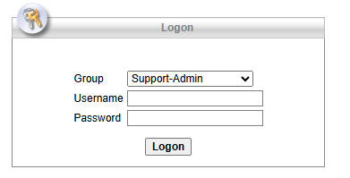
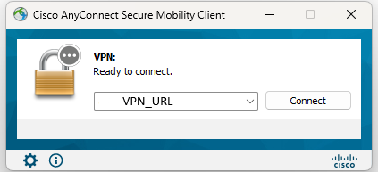

# DevFest Hackathon 2025 - Infrastructure Guide

## 🔐 Access Credentials

### Development Virtual Machine
- **VM Name**: "[VM_NAME]"
- **IP Address**: "[VM_IPADDRESS]"
- **Username**: "[VM_USERNAME]"
- **Password**: `[VM_PASSWORD]`

### VPN Connection (Required)
- **VPN URL**: "[https://secure.neyduetewa.gov.bt/]"
- **Group**: " "[VPN_GROUP]"
- **Username**: "[VPN_USERNAME]"
- **Password**: `[VPN_PASSWORD]`

## 🚀 Quick Start Guide

### Step 1: Connect to VPN

#### Download and Install Cisco AnyConnect
1. **Access Download Page**: Visit "[https://secure.neyduetewa.gov.bt/]"
2. **Login Screen**:
   - **Group**: Select "[VPN_GROUP]" from the dropdown menu
   - **Username**: Enter "[VPN_USERNAME]"
   - **Password**: Enter "[VPN_PASSWORD]"
   
2. **Download Client**: Click "Download for Windows" (or your operating system)
3. **Install AnyConnect**: Run the installer and follow the setup wizard

#### Connect Using AnyConnect
4. **Launch AnyConnect** from your applications/start menu
5. **Enter Server**: Type "[secure.neyduetewa.gov.bt]" in the server field and click "Connect"

6. **Login Screen**: You'll see a login form with three fields:
   - **Group**: Select "[VPN_GROUP]" from the dropdown menu
   - **Username**: Enter "[VPN_USERNAME]"
   - **Password**: Enter "[VPN_PASSWORD]"
7. **Click "Logon"** to establish connection
8. **Verify Connection**: Wait for "Connected" status confirmation

> ⚠️ **Important**: You must see "Connected" status before accessing any infrastructure or NDI services

### Step 2: Access Development VM
```bash
# SSH Connection
ssh "[VM_USERNAME]"@[VM_IPADDRESS]

# When prompted, use password: "[VM_PASSWORD]"
```

### Step 3: Verify Environment
```bash
# Check available tools
node --version
npm --version
git --version

# Check if development tools are installed
which hardhat
which truffle
```

## 🐛 Troubleshooting

### VPN Issues
```bash
# Test VPN connectivity
ping 172.30.1.9

# Check VPN status (varies by client)
# OpenVPN: Check connection logs
# AnyConnect: Check connection status
```

## 📞 Support

### Technical Support Channels
- **On-site Support**: Available during hackathon hours

## 🔒 Security Guidelines

### Access Control
- **Do NOT share credentials** with other teams
- **Use secure connections** (SSH, HTTPS) only
- **Log out properly** from shared systems

### Data Protection
- **No sensitive data** should be stored permanently on VMs
- **Use environment variables** for secrets
- **Regular backups** of your project code to GitHub

### Network Security
- **VPN connection required** for all access
- **No direct internet exposure** of development services
- **Firewall rules** restrict cross-team access

## 📋 Resource Limits

### VM Specifications
- **CPU**: 4 cores
- **RAM**: 4GB
- **Storage**: 50GB SSD

### Usage Guidelines
- **Fair usage policy** applies
- **No cryptocurrency mining** or resource abuse
- **Clean up processes** after development sessions

---

**Last Updated**: June 2025  
**Support Version**: 1.0  
